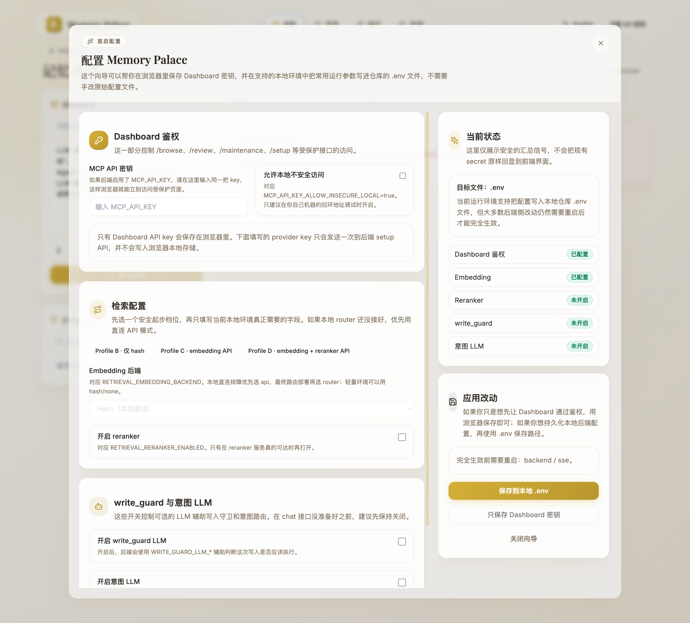

<p align="center">
  
</p>

<h1 align="center">🏛️ Memory Palace · 记忆宫殿</h1>

<p align="center">
  <strong>Memory Palace provides AI agents with persistent context and seamless cross-session continuity.</strong>
</p>

<p align="center">
  <em>"每一次对话都留下痕迹，每一道痕迹都化为记忆。"</em>
</p>

<p align="center">
  
  
  
  
  
  
  
  
</p>

<p align="center">
  <a href="README.md">English</a> · <a href="docs/README.md">文档</a> · <a href="docs/GETTING_STARTED.md">快速开始</a> · <a href="docs/EVALUATION.md">评测报告</a>
</p>

---

## 🌟 什么是 Memory Palace？

**Memory Palace（记忆宫殿）** 是一套专为 AI Agent 打造的长期记忆操作系统。它为大语言模型提供 **持久化、可检索、可审计** 的外部记忆能力——让你的 Agent 不再"每次对话都从零开始"。

通过统一的 [MCP（模型上下文协议）](https://modelcontextprotocol.io/) 接口，Memory Palace 已提供 **Codex、Claude Code、Gemini CLI、OpenCode** 的接入方案。对 `Cursor / Windsurf / VSCode-host / Antigravity` 这类 IDE 宿主，当前推荐单独走 **`AGENTS.md + MCP 配置片段`** 路径，而不是把它们当成完整 CLI skill 客户端来配置。想走最短路径时：CLI 客户端先看 [SKILLS_QUICKSTART.md](docs/skills/SKILLS_QUICKSTART.md)，IDE 宿主先看 [IDE_HOSTS.md](docs/skills/IDE_HOSTS.md)。

如果你希望 **AI 一步一步带你安装**，优先从独立的 setup-skill 仓库开始：[`memory-palace-setup`](https://github.com/AGI-is-going-to-arrive/memory-palace-setup)。当前推荐口径是 **优先走 skills + MCP**，而不是只配 MCP。比较实用的一句提示词是：`使用 $memory-palace-setup 帮我一步步安装配置 Memory Palace，优先走 skills + MCP，不要只给 MCP-only。默认先按 Profile B 起步，但如果环境允许，请主动推荐我升级到 C/D。`

### 为什么选择 Memory Palace？

| 痛点 | Memory Palace 如何解决 |
|---|---|
| 🔄 Agent 每次对话都忘记前文 | **持久化记忆存储**——基于 SQLite，记忆跨会话保留 |
| 🔍 过往上下文难以找到 | **混合检索引擎**（关键词 + 语义 + 重排序），支持意图感知搜索 |
| 🚫 无法控制写入内容 | **Write Guard** 预检每次写入；快照机制支持完整回滚 |
| 🧩 不同工具、不同集成方式 | **统一 MCP 协议**——一套接口对接所有 AI 客户端 |
| 📊 看不到系统内部状态 | **内置仪表盘**——记忆浏览、审查、维护、可观测性四大视图 |

---

## 🆕 这次版本更新了什么？

- **skills + MCP 更像产品了**：现在不只是“有工具”，而是补齐了安装、同步、smoke 和 live e2e。
- **部署更稳了**：Docker 一键脚本补了 deployment lock，运行时环境注入默认关闭，分享或正式发布前也有自检脚本兜底。
- **高干扰检索在当前基准集里表现更稳**：对照旧版本时，`s8,d200` 与 `s100,d200` 这类更容易被干扰的场景，C/D 档位显示出更好的召回。
- **前端语言切换更直接了**：当前前端默认英文，右上角新增中英切换按钮，浏览器会记住你的选择。
- **公开口径更保守了**：文档现在已经补上原生 Windows 的 repo-local `python-wrapper` 路径，但你自己的远程环境 / GUI 宿主环境仍建议按目标环境再复核一次。
- **客户端边界写清楚了**：`Claude/Codex/OpenCode/Gemini` 走文档里的 CLI 路径；`Cursor / Windsurf / VSCode-host / Antigravity` 走 `AGENTS.md + MCP 配置片段`；`Gemini live` 和 GUI 宿主验证仍保留边界说明。

---

## ✨ 核心特性

### 🔒 可审计写入流水线

每一次记忆写入都经过严格流水线：**Write Guard 预检 → 快照记录 → 异步索引重建**。Write Guard 核心动作为 `ADD`、`UPDATE`、`NOOP`、`DELETE`；`BYPASS` 作为上层 metadata-only 更新场景的流程标记，整体链路每一步均可追溯。

现在 Dashboard 树形编辑也遵循同一条规则：`POST /browse/node`、`PUT /browse/node`、`DELETE /browse/node` 在真正改数据前也会先写 Review snapshot，所以 Review 页面里能看到并回滚这些修改。

### 🔍 统一检索引擎

三种检索模式——`keyword`（关键词）、`semantic`（语义）、`hybrid`（混合）——支持自动降级。当外部 Embedding 服务不可用时，系统自动回退到关键词搜索，并在发生降级时于响应中报告 `degrade_reasons`。

### 🧠 意图感知搜索

搜索引擎默认按四类核心意图路由——**factual（事实型）**、**exploratory（探索型）**、**temporal（时间型）**、**causal（因果型）**——并匹配对应策略模板（`factual_high_precision`、`exploratory_high_recall`、`temporal_time_filtered`、`causal_wide_pool`）；当无显著信号时默认 `factual_high_precision`，当信号冲突或低信号混合时回退为 `unknown`（模板 `default`）。

### ♻️ 记忆治理循环

记忆是有生命力的实体，拥有随时间衰减的 **活力值（vitality score）**。治理循环涵盖：审查与回滚、孤儿清理、活力衰减、睡眠整合（自动碎片清理）。

### 🌐 多客户端 MCP 集成

一套协议，多端接入：当前公开文档把 **CLI 客户端** 和 **IDE 宿主** 分开说明。`Claude Code / Codex / Gemini CLI / OpenCode` 走技能文档里的 CLI 路径；`Cursor / Windsurf / VSCode-host / Antigravity` 走 repo-local 规则文件加 MCP 配置片段。

### 📦 灵活部署

四种部署档位（A/B/C/D），从纯本地到云端连接，支持 Docker 部署和一键脚本。当前最完整的大链路验证仍是 `macOS + Docker`；原生 Windows 现在已有通过 `backend/mcp_wrapper.py` 的 repo-local stdio 路径，但远程场景和 GUI 宿主组合仍建议按目标环境再复核一次。

### 📊 内置可观测性仪表盘

基于 React 的四视图仪表盘：**记忆浏览器**、**审查与回滚**、**维护管理**、**可观测性监控**。

当前前端默认英文，点右上角语言按钮即可切到中文或切回英文。浏览器会记住你的选择，常见界面文案、日期/数字格式和一部分错误提示会跟随切换。

当浏览器里既没有已保存的 Dashboard 鉴权，也没有运行时注入的 Dashboard 鉴权时，前端会自动打开首启配置向导。它可以把 Dashboard `MCP_API_KEY` 保存到当前浏览器里，并且在应用直接连本地 checkout 时，把常见本地运行参数写进 `.env`，不需要手动编辑文件。涉及后端运行链路的改动仍然需要重启服务。

如果你想看一份按页面拆开的使用说明，可以直接打开 [中文仪表盘使用指南](docs/DASHBOARD_GUIDE_CN.md)。

---

## 🏗️ 系统架构

<p align="center">
  
</p>

```
┌─────────────────────────────────────────────────────────────┐
│                    用户 / AI Agent                          │
│       (Codex · Claude Code · Gemini CLI · OpenCode)         │
└──────────────┬──────────────────────┬───────────────────────┘
               │                      │
    ┌──────────▼──────────┐  ┌────────▼─────────┐
    │  🖥️ React 仪表盘     │  │  🔌 MCP Server    │
    │  (记忆 / 审查 /       │  │  (9 工具 + SSE)   │
    │   维护 / 可观测性)    │  │                   │
    └──────────┬──────────┘  └────────┬──────────┘
               │                      │
               └──────────┬───────────┘
                          │
                ┌─────────▼──────────┐
                │  ⚡ FastAPI 后端    │
                │  (异步 IO)         │
                └───┬────────────┬───┘
                    │            │
          ┌─────────▼──┐  ┌─────▼───────────┐
          │ 🛡️ Write    │  │ 🔍 搜索 &        │
          │   Guard     │  │   检索引擎       │
          └─────┬──────┘  └─────┬────────────┘
                │               │
          ┌─────▼──────┐  ┌─────▼───────────┐
          │ 📝 Write    │  │ ⚙️ Index Worker  │
          │   Lane      │  │   (异步队列)     │
          └─────┬──────┘  └─────┬────────────┘
                │               │
                └───────┬───────┘
                        │
                ┌───────▼────────┐
                │ 🗄️ SQLite 数据库│
                │ (单文件存储)    │
                └────────────────┘
```

---

## 🛠️ 技术栈

### 后端

| 组件 | 技术 | 版本 | 用途 |
|---|---|---|---|
| Web 框架 | [FastAPI](https://fastapi.tiangolo.com/) | ≥ 0.109 | 异步 REST API，自动生成 OpenAPI 文档 |
| ORM | [SQLAlchemy](https://www.sqlalchemy.org/) | ≥ 2.0 | 异步 ORM 与查询层；Schema 变更由仓库内 migration runner 负责 |
| 数据库 | [SQLite](https://www.sqlite.org/) + aiosqlite | ≥ 0.19 | 零配置嵌入式数据库，单文件、便携 |
| MCP 协议 | `mcp (FastMCP)` | ≥ 0.1 | 通过 stdio / SSE 传输暴露 9 个标准化工具 |
| HTTP 客户端 | [httpx](https://www.python-httpx.org/) | ≥ 0.26 | 异步 HTTP，用于 Embedding / Reranker API 调用 |
| 数据校验 | [Pydantic](https://docs.pydantic.dev/) | ≥ 2.5 | 请求/响应校验 |
| 差异引擎 | `diff_match_patch` + `difflib` fallback | — | 优先使用 `diff_match_patch` 生成语义化 diff；如果这个可选包缺失，就自动退回到 `difflib.HtmlDiff` 表格 diff，而不会阻塞后端启动 |

### 前端

| 组件 | 技术 | 版本 | 用途 |
|---|---|---|---|
| UI 框架 | [React](https://react.dev/) | 18 | 组件化仪表盘 UI |
| 构建工具 | [Vite](https://vitejs.dev/) | 7.x | 极速 HMR 开发和优化构建 |
| 样式 | [Tailwind CSS](https://tailwindcss.com/) | 3.x | 原子化 CSS 框架 |
| 动画 | [Framer Motion](https://www.framer.com/motion/) | 12.x | 流畅页面转场和微交互 |
| 路由 | React Router DOM | 6.x | 客户端路由，支撑四大视图 |
| API 客户端 | [Axios](https://axios-http.com/) | 1.x | 仪表盘 API 请求与鉴权头注入 |
| Markdown | react-markdown + remark-gfm | — | 预留给可选的 Markdown 渲染链路；当前仪表盘里的记忆正文仍以纯文本方式展示 |
| 图标 | [Lucide React](https://lucide.dev/) | — | 统一图标体系 |

### 各层实现详解

#### 写入流水线（`mcp_server.py` → `runtime_state.py` → `sqlite_client.py`）

1. **Write Guard（写入守卫）** — 每次 `create_memory` / `update_memory` 调用都先经过 Write Guard（`sqlite_client.py`）。在规则模式下，守卫以 **语义匹配 → 关键词匹配 → LLM（可选）** 的顺序判定核心动作 `ADD`、`UPDATE`、`NOOP`、`DELETE`；`BYPASS` 由上层流程在 metadata-only 更新场景标注。当设置 `WRITE_GUARD_LLM_ENABLED=true` 时，可选 LLM 通过 OpenAI 兼容 API 参与决策。

2. **Snapshot（快照）** — 在任何修改前，系统都会先记录当前记忆状态的快照。MCP 工具链路使用 `mcp_server.py` 中的快照 helper；Dashboard 的 `/browse/node` 写入也遵循同样的 path/content 快照语义，并按当前数据库作用域写入到 dashboard 专属 session。这样 Review 仪表盘里的差异对比和一键回滚才能正常工作。

3. **Write Lane（写入车道）** — 写入进入序列化队列（`runtime_state.py` → `WriteLanes`），可配置并发度（`RUNTIME_WRITE_GLOBAL_CONCURRENCY`）。这防止了单 SQLite 文件上的竞态条件。

4. **Index Worker（索引工作者）** — 每次写入完成后，异步任务入队进行索引重建（`runtime_state.py` 中的 `IndexWorker`）。工作者按 FIFO 顺序处理索引更新，不阻塞写入路径。

#### 检索流水线（`sqlite_client.py`）

1. **查询预处理** — `preprocess_query()` 对搜索查询进行规范化和分词。
2. **意图分类** — `classify_intent()` 使用关键词评分方法（`keyword_scoring_v2`）判定意图：默认为 `factual`、`exploratory`、`temporal`、`causal` 四类；无显著关键词信号时默认 `factual`（`factual_high_precision`）；信号冲突或低信号混合时回退 `unknown`（模板 `default`）。
3. **策略匹配** — 根据意图匹配策略模板（如 `factual_high_precision` 使用更严格的匹配；`temporal_time_filtered` 添加时间范围约束）。
4. **多阶段检索** — 按档位执行：
   - **档位 A**：纯关键词匹配，基于 SQLite FTS
   - **档位 B**：关键词 + 本地哈希 Embedding 混合评分
   - **档位 C/D**：关键词 + API Embedding + Reranker（OpenAI 兼容）
5. **结果组装** — 结果包含 `degrade_reasons` 字段，当任何阶段失败时调用方始终了解检索质量。

#### 记忆治理（`sqlite_client.py` → `runtime_state.py`）

- **活力衰减** — 每条记忆有活力值（最大 `3.0`，可配置）。活力按指数衰减，半衰期 `VITALITY_DECAY_HALF_LIFE_DAYS=30`。低于 `VITALITY_CLEANUP_THRESHOLD=0.35` 超过 `VITALITY_CLEANUP_INACTIVE_DAYS=14` 天的记忆被标记清理。
- **睡眠整合** — 带整合参数的 `rebuild_index` 将碎片化的小记忆合并为连贯摘要。
- **孤儿清理** — 定期扫描识别没有有效记忆引用的路径。

---

## 📁 项目结构

```
memory-palace/
├── backend/
│   ├── main.py                 # FastAPI 入口；注册 Review/Browse/Maintenance/Setup 路由
│   ├── mcp_server.py           # 9 个 MCP 工具 + 快照逻辑 + URI 解析
│   ├── runtime_state.py        # Write Lane 队列、Index Worker、活力衰减调度器
│   ├── run_sse.py              # SSE 传输层，带 API Key 鉴权网关
│   ├── requirements.txt        # 后端运行依赖
│   ├── requirements-dev.txt    # 后端测试依赖
│   ├── db/
│   │   └── sqlite_client.py    # Schema 定义、CRUD、检索、Write Guard、Gist
│   ├── api/                    # REST 路由：review、browse、maintenance、setup
├── frontend/
│   └── src/
│       ├── App.jsx             # 路由与页面脚手架
│       ├── features/
│       │   ├── memory/         # MemoryBrowser.jsx — 树形浏览器、编辑器、Gist 视图
│       │   ├── review/         # ReviewPage.jsx — 差异对比、回滚、整合
│       │   ├── maintenance/    # MaintenancePage.jsx — 活力清理任务
│       │   └── observability/  # ObservabilityPage.jsx — 检索与任务监控
│       └── lib/
│           └── api.js          # 统一 API 客户端，运行时注入鉴权信息
├── deploy/
│   ├── profiles/               # A/B/C/D 档位模板（macOS/Windows/Docker）
│   └── docker/                 # Dockerfile 和 Compose 辅助配置
├── scripts/
│   ├── apply_profile.sh        # macOS/Linux 档位应用脚本
│   ├── apply_profile.ps1       # Windows 档位应用脚本
│   ├── backup_memory.sh        # macOS/Linux SQLite 一致性备份
│   ├── backup_memory.ps1       # Windows SQLite 一致性备份
│   ├── docker_one_click.sh     # macOS/Linux 一键 Docker 部署
│   ├── docker_one_click.ps1    # Windows 一键 Docker 部署
│   └── pre_publish_check.sh    # 分享前本地产物 / 泄露扫描
├── docs/                       # 完整文档集
├── .env.example                # 配置模板（含详细注释）
├── docker-compose.yml          # Docker Compose 定义
└── LICENSE                     # MIT 许可证
```

---

## 📋 环境要求

| 组件 | 最低版本 | 推荐版本 |
|---|---|---|
| Python | 3.10+ | 3.11+ |
| Node.js | 20.19+（或 >=22.12） | 最新 LTS |
| npm | 9+ | 最新稳定版 |
| Docker（可选） | 20+ | 最新稳定版 |

---

## 🚀 快速开始

### 方式一：直接拉取预构建 Docker 镜像（最省事的用户路径）

如果你本地构建环境总是出问题，先走 GHCR 预构建镜像这条路。这条路径的目标是**先把服务跑起来**，不是在你本机重新 build 镜像。

```bash
git clone https://github.com/AGI-is-going-to-arrive/Memory-Palace.git
cd Memory-Palace

cp .env.example .env.docker
bash scripts/apply_profile.sh docker b .env.docker

docker compose -f docker-compose.ghcr.yml pull
docker compose -f docker-compose.ghcr.yml up -d
```

```powershell
git clone https://github.com/AGI-is-going-to-arrive/Memory-Palace.git
cd Memory-Palace

Copy-Item .env.example .env.docker
.\scripts\apply_profile.ps1 -Platform docker -Profile b -Target .env.docker

docker compose -f docker-compose.ghcr.yml pull
docker compose -f docker-compose.ghcr.yml up -d
```

默认访问地址：

| 服务 | 地址 |
|---|---|
| 前端仪表盘 | <http://127.0.0.1:3000> |
| 后端 API | <http://127.0.0.1:18000> |
| SSE | <http://127.0.0.1:3000/sse> |

先记住几个边界：

- 这条路径绕开的是**本地镜像构建**，不是“完全不需要仓库 checkout”。你仍然需要仓库里的 `docker-compose.ghcr.yml`、`.env.example` 和 profile 脚本。
- 这条路径解决的是 **Dashboard / API / SSE 服务启动**。
- 它**不会**自动把 `Claude / Codex / Gemini / OpenCode / Cursor / Antigravity` 这些客户端在你机器上的 skill / MCP 配置一起改好。
- 如果你还想用当前仓库现成的 repo-local skill + MCP 自动化安装链路，保留这个 checkout，再继续看 [docs/skills/GETTING_STARTED.md](docs/skills/GETTING_STARTED.md)。
- 如果你不走 repo-local 安装链路，也可以手工把支持远程 SSE 的 MCP 客户端指到 `http://localhost:3000/sse`，并配置同一把 API key / 鉴权头。这里的 `<YOUR_MCP_API_KEY>` 默认就读刚生成的 `.env.docker` 里的 `MCP_API_KEY`。
- `scripts/run_memory_palace_mcp_stdio.sh` 不是 Docker 客户端入口。它依赖本地 `bash` 和 `backend/.venv`，只会复用宿主机上的本地 `.env` / `DATABASE_URL`，不会复用容器里的 `/app/data`。
- 如果你后面要切回本机 `stdio` 客户端，本地 `.env` 必须写宿主机可访问的绝对路径。仓库里只有 `.env.docker` 而没有本地 `.env` 时，它会明确拒绝回退到 `demo.db`；如果 `.env` 或显式 `DATABASE_URL` 仍写成 `/app/...` 这类容器路径，它也会直接拒绝启动，并提示你改成本机路径或走 Docker 暴露的 `/sse`。
- 和 `docker_one_click.sh/.ps1` 不同，GHCR compose 路径**不会自动换端口**。如果 `3000` / `18000` 已被占用，请在启动前自己设置 `MEMORY_PALACE_FRONTEND_PORT` / `MEMORY_PALACE_BACKEND_PORT`。
- 如果容器需要访问你宿主机上的本地模型服务，优先使用 `host.docker.internal`。当前 compose 已显式补 `host.docker.internal:host-gateway`，Linux Docker 也可以沿这条路径访问宿主机服务。

停止服务：

```bash
docker compose -f docker-compose.ghcr.yml down --remove-orphans
```

### 方式二：手动本地搭建（推荐新手使用）

> **💡 提示**：本教程推荐你先以 **档位 B** 为目标，这样可以在**零外部模型服务**的前提下跑通全流程。
> 如果你希望日常使用时拿到更好的检索效果，**强烈建议后续升级到档位 C**；但请先按 [升级到档位 C/D](#-升级到档位-cd) 中的说明补齐 embedding / reranker / LLM 对应配置。

#### 第 1 步：克隆仓库

```bash
git clone https://github.com/AGI-is-going-to-arrive/Memory-Palace.git
cd Memory-Palace
```

#### 第 2 步：创建配置文件

选择以下 **任一** 方法：

**方法 A — 复制模板手动编辑：**

```bash
cp .env.example .env
```

> 这条路径用的是**更保守的 `.env.example` 最小模板**。它足够你先把本地服务跑起来，但**不等于已经套用了仓库里的档位 B 模板**。
>
> 如果你想直接拿到仓库预设好的档位 B 默认值（例如本地 hash Embedding），请直接使用下面的**方法 B**。如果你继续走方法 A 也没问题，就把它理解成“从最小模板手动往上补配置”即可。

然后打开 `.env`，将 `DATABASE_URL` 设置为你机器上的实际路径。共享环境或接近生产的场景更推荐使用绝对路径：

```bash
# macOS / Linux 示例：
DATABASE_URL=sqlite+aiosqlite:////absolute/path/to/demo.db

# Windows 示例：
DATABASE_URL=sqlite+aiosqlite:///C:/absolute/path/to/demo.db
```

> 不要把 Docker / GHCR 路径里的 `sqlite+aiosqlite:////app/data/...` 直接写进本地 `.env`。`/app/...` 是容器内路径，不是你宿主机上的真实文件路径；repo-local `stdio` wrapper 现在会明确拒绝这种配置。本地 `stdio` 请改成宿主机绝对路径；如果你就是要复用 Docker 那边的数据和服务，请直接改连 Docker 暴露的 `/sse`。

如果你想立刻在本地使用 Dashboard，或者直接调用 `/browse` / `/review` / `/maintenance`，请先把下面二选一写进 `.env`，再启动后端：

```dotenv
# 方式 A：设置一把本地 API Key（推荐）
MCP_API_KEY=change-this-local-key

# 方式 B：仅限本机回环调试时跳过鉴权（不要用于共享环境）
MCP_API_KEY_ALLOW_INSECURE_LOCAL=true
```

**方法 B — 使用档位脚本（推荐）：**

```bash
# macOS / Linux（这里仍然使用 `macos` 这个模板值）
bash scripts/apply_profile.sh macos b

# Windows PowerShell
.\scripts\apply_profile.ps1 -Platform windows -Profile b
```

脚本会根据平台从 `deploy/profiles/{macos,windows,docker}/profile-b.env` 模板生成一份 **基于档位 B 的 `.env`**。

把 `deploy/profiles/*/*.env` 理解成 **Profile 模板输入**，不要直接手抄某个模板文件当成最终 `.env`。有些模板值会先保留占位路径，再由 `apply_profile.*` 按当前仓库位置自动改写。

如果你前面已经生成过 `.env.docker`，也不要直接把那份 Docker 文件改名成 `.env`。Docker profile 里的 `/app/data/...` 只对容器有效；本机 `stdio` MCP 需要宿主机自己的绝对路径。

但要注意：

- **macOS / Windows 本地启动**时，脚本**不会**自动帮你填 `MCP_API_KEY`
- 如果你想立刻用 Dashboard、`/browse` / `/review` / `/maintenance`，或者 `/sse` / `/messages`，还需要自己再补一项：
  - `MCP_API_KEY=change-this-local-key`
  - 或 `MCP_API_KEY_ALLOW_INSECURE_LOCAL=true`（仅限你自己机器上的回环调试）
- 只有 **docker 平台**下，`apply_profile` 才会在 `MCP_API_KEY` 为空时自动生成一把本地 key

#### 第 3 步：启动后端

```bash
cd backend

# 创建并激活虚拟环境
python -m venv .venv
source .venv/bin/activate        # Windows PowerShell：.\.venv\Scripts\Activate.ps1

# 安装依赖
pip install -r requirements.txt

# 如果你后面还要跑后端测试
# pip install -r requirements-dev.txt

# 启动 API 服务器
uvicorn main:app --host 127.0.0.1 --port 8000 --reload
```

正常情况下你会看到：

```
Memory API starting...
SQLite database initialized.
INFO:     Uvicorn running on http://127.0.0.1:8000
```

> 上面这条 `uvicorn main:app --host 127.0.0.1 ...` 是推荐的**本机开发**写法。
>
> 如果你机器上的 Python 命令名是 `python3` 而不是 `python`，把上面命令里的 `python` 换成 `python3` 即可。
>
> 如果你改为直接运行 `python main.py`，当前默认也是绑定 `127.0.0.1:8000`，不会自动放开到 `0.0.0.0`。只有在你明确需要远程访问时，才手动改成 `0.0.0.0`（或你的实际绑定地址），并补齐 `MCP_API_KEY`、防火墙、反向代理或其他网络侧保护。

#### 第 4 步：启动前端

打开一个 **新的终端窗口**：

```bash
cd frontend

# 安装依赖
npm install

# 启动开发服务器
npm run dev
```

正常情况下你会看到：

```
  VITE v7.x.x  ready

  ➜  Local:   http://localhost:5173/
```

#### 第 5 步：验证安装

```bash
# 检查后端健康状态
curl -s http://127.0.0.1:8000/health | python -m json.tool

# 浏览记忆树
#
# 方式 A：如果你配置了 `MCP_API_KEY`
curl -s "http://127.0.0.1:8000/browse/node?domain=core&path=" \
  -H "X-MCP-API-Key: <YOUR_MCP_API_KEY>" | python -m json.tool

# 方式 B：如果你启用了 `MCP_API_KEY_ALLOW_INSECURE_LOCAL=true`
curl -s "http://127.0.0.1:8000/browse/node?domain=core&path=" | python -m json.tool
```

在浏览器中打开 **<http://localhost:5173>** —— 你应该能看到 Memory Palace 仪表盘 🎉

> 如果本地手动启动后右上角出现 `设置 API 密钥`（英文模式下会显示 `Set API key`），这是正常现象。说明前端页面已经起来了，但受保护的数据请求（`/browse/*`、`/review/*`、`/maintenance/*`）仍然遵循 `MCP_API_KEY` / `MCP_API_KEY_ALLOW_INSECURE_LOCAL` 的鉴权规则。独立的 MCP SSE 端点（`/sse`、`/messages`）也遵循同一规则。
>
> 如果你配置了 `MCP_API_KEY`，打开页面后请点右上角 `设置 API 密钥`（英文模式下会显示 `Set API key`）打开首启向导；你可以只把同一把 key 保存到当前浏览器，也可以在“本地 checkout + 非 Docker 运行”的场景下，把常见运行参数一起写进 `.env`。如果你启用了 `MCP_API_KEY_ALLOW_INSECURE_LOCAL=true`，直连本机回环地址（`127.0.0.1` / `::1` / `localhost`，且不带 forwarded headers）的请求可直接访问这些受保护数据请求。
>
> 如果你选择的是“只保存 Dashboard 密钥”，这把 key 会一直保留在当前浏览器里，直到你手动清除。向导里的 `Profile C/D` 预设现在已经按文档口径走 `router + reranker` 路线；如果你本机的 router 还没准备好，就手动把检索字段切回直连 API 模式排障。
>
> 这个向导不会假装自己能热更新 Docker 容器里的 env / 代理配置。只要涉及 embedding / reranker / write_guard / intent 这类后端侧参数，保存之后仍然需要按实际部署方式重启对应服务。

#### 第 6 步：连接 AI 客户端

启动 MCP 服务器以便 AI 客户端访问 Memory Palace：

```bash
cd backend

# stdio 模式（用于常见 stdio 客户端，如 Claude Code / Codex / OpenCode）
python mcp_server.py

# 如果你是在新终端或客户端配置里启动，下面这条更稳
./.venv/bin/python mcp_server.py   # Windows PowerShell：.\.venv\Scripts\python.exe mcp_server.py

# SSE 模式（下面这个命令是本机回环示例；远程访问请改 HOST）
HOST=127.0.0.1 PORT=8010 python run_sse.py
```

```powershell
cd backend
$env:HOST = "127.0.0.1"
$env:PORT = "8010"
python run_sse.py
```

> 说明：`stdio` 直接连接 MCP 工具进程，不经过 HTTP/SSE 鉴权中间层；未设置 `MCP_API_KEY` 时也可本地使用 MCP 工具。这里说的是 `stdio` 本身，不包括受保护的 HTTP / SSE 路由。
>
> 上面这条 `python mcp_server.py` 默认你还在使用刚才安装依赖的那个 `backend/.venv`。如果你换了一个新终端，或者是在 Claude Code / Codex / OpenCode 这类客户端里配置本地 MCP，优先直接指向项目自己的 `.venv`。否则很容易因为解释器不对，在启动前就报 `ModuleNotFoundError: No module named 'sqlalchemy'`。
>
> 如果你要把 MCP 接到客户端配置里，先按本机 shell 边界选 launcher：
>
> - 原生 Windows：优先 `backend/mcp_wrapper.py`
> - macOS / Linux / Git Bash / WSL：优先 `scripts/run_memory_palace_mcp_stdio.sh`
>
> 这两条 launcher 都会优先复用当前仓库的 `backend/.venv` 和 `.env` / `DATABASE_URL`；只有在仓库里既没有本地 `.env`、也没有 `.env.docker` 时，才会回退到仓库默认 SQLite 路径。若仓库里只有 `.env.docker`，或者本地 `.env` 里的 `DATABASE_URL` 仍写成 Docker 容器内路径（例如 `sqlite+aiosqlite:////app/data/memory_palace.db`），它都会明确拒绝启动，并提示你改走 Docker 暴露的 `/sse` 或改回宿主机绝对路径。
>
> 同样地，如果 `.env` 或你显式传入的 `DATABASE_URL` 仍是 `/app/...` 这类 Docker 容器路径，wrapper 现在也会直接拒绝启动。这不是 MCP 协议故障，而是本机路径配置错了；改成宿主机绝对路径，或者继续走 Docker `/sse`。
>
> 上面这个 `HOST=127.0.0.1` 是**只给本机访问**的写法；即使你直接运行 `python run_sse.py`，默认也仍是回环地址。真要给远程客户端访问，请改成 `HOST=0.0.0.0`（或你的实际绑定地址）。这一步只是把监听范围放开，**不等于**跳过安全控制；API Key、防火墙、反向代理和传输安全仍然要自己补齐。

详细的客户端配置请参阅 [多客户端集成](#-多客户端集成)。

---

### 方式三：一键 Docker 部署

```bash
# macOS / Linux
bash scripts/docker_one_click.sh --profile b

# Windows PowerShell
.\scripts\docker_one_click.ps1 -Profile b

# 仅在需要时显式注入当前进程环境（默认关闭）
bash scripts/docker_one_click.sh --profile c --allow-runtime-env-injection
# 或
.\scripts\docker_one_click.ps1 -Profile c -AllowRuntimeEnvInjection
```

> Docker 一键部署会自动启动三部分：
>
> - Dashboard：`http://127.0.0.1:3000`
> - Backend API：`http://127.0.0.1:18000`
> - SSE：`http://127.0.0.1:3000/sse`
>
> 如果 Docker env 文件里的 `MCP_API_KEY` 为空，脚本会自动生成一把本地 key。前端会在代理层自动带上这把 key，所以按推荐的一键脚本路径启动时，**受保护请求通常已经能直接用**；但页面右上角仍可能继续显示 `设置 API 密钥`（英文模式下会显示 `Set API key`），因为浏览器页面本身并不知道代理层的真实 key。这不一定代表配置坏了；只有当受保护数据也一起报 `401` 或空态时，才需要继续排查 env / 代理配置。
>
> 也请把这个 Docker 前端端口当成可信操作员 / 管理入口。只要有人能直接访问 `http://<你的主机>:3000`，他就能使用 Dashboard 以及被代理的受保护接口，所以不要把这个端口当成“有 `MCP_API_KEY` 就等于终端用户鉴权”的公网入口；若要给受信范围之外的人访问，请先在前面加你自己的 VPN、反向代理鉴权或网络访问控制。
>
> Windows 复核说明（2026 年 3 月 19 日）：这条 repo-local `docker compose -f docker-compose.yml` 路径，已经在原生 Windows 上重新做过端到端验证。`http://127.0.0.1:3000/sse` 会返回 `HTTP 200`，并给出 `/messages/?session_id=...`；`Claude` 和 `Gemini` 也都已经通过这个前端代理 SSE 入口完成过真实的 `read_memory(system://boot)` 调用。
>
> 现在 Docker 前端会等 **backend 和 SSE 各自的 `/health`** 都通过，才算真正 ready。容器刚起来时如果页面还没完全可用，先多等几秒，再按控制台打印出的地址重试即可。
>
> 当前 Docker 前端还会对 `/index.html` 返回 `Cache-Control: no-store, no-cache, must-revalidate`，尽量减少“前端已经更新，但浏览器还拿着旧入口页面”的情况。如果你刚升级完镜像仍看到明显旧页面，先确认容器已经是新版本，再手动刷新一次页面；只有在你额外接了自己的反向代理或 CDN 时，才需要继续检查这些中间层是否改写了缓存头。
>
> Docker 默认还会分别持久化两类运行期数据：数据库卷会按 compose project 隔离为 `<compose-project>_data`（容器内 `/app/data`），snapshot 卷会隔离为 `<compose-project>_snapshots`（容器内 `/app/snapshots`）。如果你确实要复用旧的共享卷，请显式设置 `MEMORY_PALACE_DATA_VOLUME` / `MEMORY_PALACE_SNAPSHOTS_VOLUME`。如果你执行 `docker compose down -v` 或手动删除这些卷，这两部分都会一起清空。
>
> 这也会直接影响审查页：当你切到另一组数据卷或另一个 compose project 时，可见的 rollback 会话会跟着那份数据库一起切换，而不是把不同环境的会话混在一起。

| 服务 | 地址 |
|---|---|
| 前端仪表盘 | <http://127.0.0.1:3000> |
| 后端 API | <http://127.0.0.1:18000> |
| SSE | <http://127.0.0.1:3000/sse> |
| 健康检查 | <http://127.0.0.1:18000/health> |

> 注：以上为默认端口。若端口被占用，一键脚本会自动调整并在控制台输出实际地址。

停止服务：

```bash
COMPOSE_PROJECT_NAME=<控制台打印出的 compose project> docker compose -f docker-compose.yml down --remove-orphans
```

---

## ⚙️ 部署档位（A / B / C / D）

Memory Palace 提供四种部署档位以匹配你的硬件和需求：

| 档位 | 检索模式 | Embedding | Reranker | 适用场景 |
|---|---|---|---|---|
| **A** | 纯 `keyword` | ❌ 关闭 | ❌ 关闭 | 🟢 最小资源，初步验证 |
| **B** | `hybrid` 混合 | 📦 本地哈希 | ❌ 关闭 | 🟡 **默认起步档位**——本地开发，无需外部服务 |
| **C** | `hybrid` 混合 | 🌐 Router / API | ✅ 开启 | 🟠 **强烈推荐档位**——你已经准备好本地模型服务 |
| **D** | `hybrid` 混合 | 🌐 Router / API | ✅ 开启 | 🔴 远程 API，生产环境 |

> **说明**：档位 C 和 D 共享相同的混合检索流水线（`keyword + semantic + reranker`）。当前仓库附带模板的主要区别是模型服务地址（本地 vs 远程）以及默认 `RETRIEVAL_RERANKER_WEIGHT`（`0.30` vs `0.35`）。

### 🔼 升级到档位 C/D

**档位 C 是强烈推荐的目标档位**，但它不是“切过去就自动好用”的零配置方案。

- 想先无脑跑通仓库，默认还是从 **档位 B** 开始
- 想把检索质量拉起来，再升级到 **档位 C**
- 升级时至少要把 `.env` 里的 **embedding** 和 **reranker** 相关参数填好
- 如果你还想启用 LLM 辅助的 write guard / gist / intent routing，也要把对应的 `WRITE_GUARD_LLM_*`、`COMPACT_GIST_LLM_*`、可选的 `INTENT_LLM_*` 一并填好

在 `.env` 文件中配置以下参数。所有端点均支持 **OpenAI 兼容 API** 格式，包括本地部署的 Ollama 或 LM Studio：

```bash
# ── Embedding 模型 ──────────────────────────────────────────
RETRIEVAL_EMBEDDING_BACKEND=api
RETRIEVAL_EMBEDDING_API_BASE=http://localhost:11434/v1   # 例如 Ollama
RETRIEVAL_EMBEDDING_API_KEY=your-api-key
RETRIEVAL_EMBEDDING_MODEL=your-embedding-model-id

# ── Reranker 模型 ───────────────────────────────────────────
RETRIEVAL_RERANKER_ENABLED=true
RETRIEVAL_RERANKER_API_BASE=http://localhost:11434/v1
RETRIEVAL_RERANKER_API_KEY=your-api-key
RETRIEVAL_RERANKER_MODEL=your-reranker-model-id

# ── 调参旋钮（推荐 0.20 ~ 0.40）────────────────────────────
RETRIEVAL_RERANKER_WEIGHT=0.25
```

> 配置语义说明：
> - `RETRIEVAL_EMBEDDING_BACKEND` 只控制 Embedding 链路。
> - Reranker 没有 `RETRIEVAL_RERANKER_BACKEND` 开关，启用与否由 `RETRIEVAL_RERANKER_ENABLED` 控制。
> - Reranker 连接参数优先读取 `RETRIEVAL_RERANKER_API_BASE/API_KEY/MODEL`；缺失时才回退 `ROUTER_*`（其中 base/key 还可继续回退 `OPENAI_*`）。
>
> 如果你的 provider 对 Embedding / Reranker 使用的是带命名空间的 model id（例如 `Qwen/...`），请填写你自己的 provider 实际 model id，不要把示例值原样照抄到别的环境。
> 如果你后面要用 `docker_one_click.sh/.ps1` 跑 `profile c/d`，这些示例 model id 也会被当成未解析占位符；在换成真实值之前，脚本会直接在 `docker compose` 前 fail-closed。
>
> **推荐口径（重要）**：
> - **本地开发 / 调试**：优先直接分别配置 `RETRIEVAL_EMBEDDING_*`、`RETRIEVAL_RERANKER_*`、`WRITE_GUARD_LLM_*` / `COMPACT_GIST_LLM_*`。
> - **为什么这样配**：因为三条链路的可达性、模型名、性能瓶颈往往不同，分别直配更容易定位问题，也不会把“本机 router 没有某个模型”的问题误判成整个系统故障。
> - **生产 / 客户环境**：若已有统一模型网关，再回到 `router` 主链路；它更适合承接统一鉴权、限流、审计和模型切换，但不是本地调试的硬性前提。
> - **更多高级配置**：例如 `INTENT_LLM_*`、`CORS_ALLOW_*`、`RETRIEVAL_MMR_*` 与运行时观测/睡眠整合开关，统一以 `.env.example` 和 `docs/DEPLOYMENT_PROFILES.md` 为准。
> - **这些开关怎么理解**：
>   - `INTENT_LLM_ENABLED`：实验能力，默认建议保持 `false`
>   - `RETRIEVAL_MMR_ENABLED`：只有 hybrid 检索下才有意义，默认建议保持 `false`
>   - `CORS_ALLOW_ORIGINS`：本地开发建议留空；要给浏览器跨域访问时再显式写允许域名
>   - `RETRIEVAL_SQLITE_VEC_ENABLED`：当前仍是 rollout 开关，普通用户部署默认建议保持 `false`

### 可选：LLM 驱动的 Write Guard 与 Gist

```bash
# ── Write Guard LLM（写入守卫）──────────────────────────────
WRITE_GUARD_LLM_ENABLED=true
WRITE_GUARD_LLM_API_BASE=http://localhost:11434/v1
WRITE_GUARD_LLM_API_KEY=your-api-key
WRITE_GUARD_LLM_MODEL=your-chat-model-id

# ── Compact Gist LLM（留空则回退至 Write Guard 配置）───────
COMPACT_GIST_LLM_ENABLED=true
COMPACT_GIST_LLM_API_BASE=
COMPACT_GIST_LLM_API_KEY=
COMPACT_GIST_LLM_MODEL=your-chat-model-id
```

> 上面这些模型名只是占位示例，不是项目硬依赖。Memory Palace 不绑定某个固定 provider 或模型家族；请直接填写你自己的 OpenAI-compatible 服务里实际可用的 embedding / reranker / chat model id。如需调整 Intent LLM、CORS、自定义 MMR、sqlite-vec rollout 或运行时审计上限，请直接参考 `.env.example`；README 只保留最常用主配置。
>
> 如果你在本地用 `--allow-runtime-env-injection` 调试 `profile c/d`，脚本会把这次运行切到显式 API 模式；它现在会一起透传显式的 `RETRIEVAL_EMBEDDING_*`（包括 `RETRIEVAL_EMBEDDING_DIM`）、`RETRIEVAL_RERANKER_ENABLED` / `RETRIEVAL_RERANKER_*`，以及可选的 `WRITE_GUARD_LLM_*` / `COMPACT_GIST_LLM_*` / `INTENT_LLM_*`。当 `RETRIEVAL_EMBEDDING_API_*` / `RETRIEVAL_RERANKER_API_*` 没填时，会把 `ROUTER_API_BASE/ROUTER_API_KEY` 作为 embedding / reranker API base+key 的兜底来源；如果 `RETRIEVAL_RERANKER_MODEL` 还没显式填写，也会优先回退到 `ROUTER_RERANKER_MODEL`。
>
> 对本地 Docker build 路径来说，一键脚本现在还会使用按 checkout 固定的本地镜像名。实际效果就是：只要这个 checkout 里之前已经 build 过一次，即使你换了 `COMPOSE_PROJECT_NAME`，`--no-build` 也还能继续复用这些本地镜像；只有第一次启动或你手动删掉本地镜像时，才需要重新走 `--build`。

档位模板位于：`deploy/profiles/{macos,windows,docker}/profile-{a,b,c,d}.env`

完整参数参考：[DEPLOYMENT_PROFILES.md](docs/DEPLOYMENT_PROFILES.md)

---

## 🔌 MCP 工具参考

Memory Palace 通过 MCP 协议暴露 **9 个标准化工具**：

| 类别 | 工具 | 说明 |
|---|---|---|
| **读写** | `read_memory` | 读取记忆内容（完整或按 `RETRIEVAL_CHUNK_SIZE` 分块）|
| | `create_memory` | 创建新记忆节点（先通过 Write Guard 预检；建议始终显式填写 `title`）|
| | `update_memory` | 更新现有记忆（优先用 Patch；只有真的要追加到末尾时再用 Append）|
| | `delete_memory` | 删除记忆路径 |
| | `add_alias` | 为记忆添加别名路径 |
| **检索** | `search_memory` | 统一搜索入口，支持 `keyword` / `semantic` / `hybrid` 模式 |
| **治理** | `compact_context` | 压缩会话上下文为长期摘要（Gist + Trace）|
| | `rebuild_index` | 触发索引重建 / 睡眠整合 |
| | `index_status` | 查询索引可用性和运行时状态 |

### 系统 URI

| URI | 说明 |
|---|---|
| `system://boot` | 读取该 URI 时按 `CORE_MEMORY_URIS` 加载核心记忆 |
| `system://index` | 完整记忆索引概览 |
| `system://index-lite` | 基于 gist 的轻量索引摘要 |
| `system://audit` | 聚合后的观测 / 审计摘要 |
| `system://recent` | 最近修改的记忆 |
| `system://recent/N` | 最近 N 条记忆 |

### 启动 MCP 服务器

```bash
# stdio 模式（用于常见 stdio 客户端——Claude Code、Codex、OpenCode 等）
cd backend && python mcp_server.py

# 如果你是在新终端或客户端配置里启动，下面这条更稳
cd backend && ./.venv/bin/python mcp_server.py   # Windows PowerShell：cd backend && .\.venv\Scripts\python.exe mcp_server.py

# SSE 模式（下面这个命令是本机回环示例；远程访问请改 HOST）
cd backend && HOST=127.0.0.1 PORT=8010 python run_sse.py
```

> 上面这条 `python mcp_server.py` 默认 `backend/.venv` 已经激活；如果不是，优先改用项目自己的 `.venv` 解释器，避免启动时用错 Python。
>
> 只有在你确实需要远程客户端时，才改成 `HOST=0.0.0.0`；同时记得补齐网络侧安全措施。

完整工具语义：[TOOLS.md](docs/TOOLS.md)

---

## 🔄 多客户端集成

MCP 工具层负责 **确定性执行**；Skills 策略层负责 **策略与时机**。

<p align="center">
  
</p>

### 推荐默认流程

```
1. 🚀 启动    → read_memory("system://boot")               # 加载核心记忆
2. 🔍 召回    → search_memory(include_session=true)         # 话题召回
3. ✍️ 写入    → 优先 update_memory 的 Patch；新建用带 title 的 create_memory    # 先读后写
4. 📦 压缩    → compact_context(force=false)                 # 会话压缩
5. 🔧 恢复    → rebuild_index(wait=true) + index_status()   # 降级恢复
```

### 支持的客户端

| 客户端 | 集成方式 |
|---|---|
| Claude Code | 新机器上更稳的默认方案是 `user` 级安装；只有你还想补当前仓库项目级入口时，再额外执行 workspace 安装 |
| Gemini CLI | 新机器上更稳的默认方案是 `user` 级安装；workspace 安装在当前仓库里仍然只是可选补充 |
| Codex CLI / OpenCode | `sync` 只解决 repo-local skill 自动发现；如果你想稳定绑到当前仓库 backend，仍建议补 `--scope user --with-mcp` |
| Cursor / Windsurf / VSCode-host / Antigravity | repo-local `AGENTS.md` + `python scripts/render_ide_host_config.py --host ...` |

### 安装 Skill

```bash
python scripts/sync_memory_palace_skill.py
python scripts/sync_memory_palace_skill.py --check
python scripts/install_skill.py --targets claude,codex,gemini,opencode --scope user --with-mcp --force
python scripts/install_skill.py --targets claude,gemini --scope workspace --with-mcp --force
python scripts/install_skill.py --targets claude,gemini --scope workspace --with-mcp --check
```

如果你要补 workspace 级 MCP，当前脚本只会为 `Claude Code` 和 `Gemini CLI` 写稳定的 repo-local 绑定；`Codex/OpenCode` 继续走 user-scope MCP 更稳。

如果你接的是 IDE 宿主，不要先找 hidden skill mirrors，直接生成当前仓库的 MCP 配置片段：

```bash
python scripts/render_ide_host_config.py --host cursor
python scripts/render_ide_host_config.py --host windsurf
python scripts/render_ide_host_config.py --host vscode
python scripts/render_ide_host_config.py --host antigravity
```

如果宿主存在 `stdin/stdout` 或 CRLF 兼容问题，再改用 wrapper 版本：

```bash
python scripts/render_ide_host_config.py --host antigravity --launcher python-wrapper
```

如果你想在自己的机器上额外做一轮本地验证，再运行：

```bash
python scripts/evaluate_memory_palace_skill.py
cd backend && python ../scripts/evaluate_memory_palace_mcp_e2e.py
```

其中 `Gemini CLI`、`Codex CLI`、`OpenCode` 在新机器上都更建议优先补一次 `user` 级 MCP 安装：

```bash
python scripts/install_skill.py --targets gemini,codex,opencode --scope user --with-mcp --force
```

上面这两条更适合作为补充验证，不需要把它们理解成新手第一次安装时的必做步骤。

canonical 真源，以及你执行 CLI 同步/安装命令后在本地会看到的路径：

- Canonical：`<repo-root>/docs/skills/memory-palace/`
- Claude Code：`<repo-root>/.claude/skills/memory-palace/`
- Codex CLI：`<repo-root>/.codex/skills/memory-palace/`
- OpenCode：`<repo-root>/.opencode/skills/memory-palace/`

这些隐藏目录都是安装后生成的本地镜像目录。刚 clone 下来时，通常只会先看到 `docs/skills/memory-palace/` 这份 canonical bundle。

对 IDE 宿主，推荐看的不是这些 hidden mirrors，而是：

- repo-local 规则入口：`<repo-root>/AGENTS.md`
- MCP 配置片段：`python scripts/render_ide_host_config.py --host <cursor|windsurf|vscode|antigravity>`
- `Antigravity` 兼容层：只有宿主确实需要 wrapper 时，才改用 `backend/mcp_wrapper.py`

这套 skill 已按当前真实代码口径收敛：

- 会话启动优先 `read_memory("system://boot")`
- URI 不确定时优先 `search_memory(..., include_session=true)`
- 写入遵循“先读后写”，并显式处理 `guard_action` / `guard_reason`
- 检索降级时先 `index_status()`，再视情况 `rebuild_index(wait=true)`
- `guard_action=NOOP` 时不要继续写入；先检查建议目标，再决定是否切换为 `update_memory`
- 触发样例集固定在 `<repo-root>/docs/skills/memory-palace/references/trigger-samples.md`

如果你想额外复核 skill smoke 或真实 MCP 端到端链路，运行 `python scripts/evaluate_memory_palace_skill.py` 和 `cd backend && python ../scripts/evaluate_memory_palace_mcp_e2e.py`。它们默认会在 `docs/skills/` 下生成本地报告；如果你在并行 review 或 CI 里想隔离输出，可先设置 `MEMORY_PALACE_SKILL_REPORT_PATH` / `MEMORY_PALACE_MCP_E2E_REPORT_PATH`。`evaluate_memory_palace_skill.py` 现在只要任一检查是 `FAIL` 就会返回非零退出码；`SKIP` / `PARTIAL` / `MANUAL` 不会单独让进程失败，当前默认的 Gemini smoke 模型是 `gemini-3-flash-preview`。对于刚 clone 下来、还没安装 workspace mirrors 的仓库，脚本现在会把这类状态记成 `PARTIAL`，不再直接当成硬失败。如果当前机器根本没有 `Antigravity` 宿主 runtime，就把 `antigravity` 那一项看成“目标宿主上的手工补验还没做”，不要先理解成仓库主链路失败。

现在这条 live MCP e2e 脚本会跟用户实际连接时一样，优先走 repo-local wrapper。按当前验证链路，它也会把 wrapper 行为和 `compact_context` 的 gist 持久化一起带上复核，而不只是检查工具清单。

完整指南见：

- [MEMORY_PALACE_SKILLS.md](docs/skills/MEMORY_PALACE_SKILLS.md)
- [IDE_HOSTS.md](docs/skills/IDE_HOSTS.md)

---

## 📊 评测结果

> 这里保留**对用户有用的摘要表**，用于说明当前版本的大致表现。
>
> 想看方法、边界和复现命令，直接看 `docs/EVALUATION.md`；想看这次发布里采用的同口径旧版 vs 当前版本摘要，直接看 `docs/changelog/release_summary_vs_old_project_2026-03-06.md`。
>
> 下面这些数字是发布摘要，不代表所有硬件、provider 或网络条件下都会完全一致。

### 检索质量 — A/B/C/D 真实运行

数据源：`profile_abcd_real_metrics.json` · 每数据集样本量 = 8 · 10 个干扰文档 · Seed = 20260219 · 这类 JSON 通常是维护阶段在本地复核时生成的 benchmark 产物

> 📌 这组数字是当前发布轮次的一次摘要运行；硬件、模型服务和网络条件不同，结果也可能不同。

> 📌 这些指标怎么理解：
>
> - `HR@10`：前 10 条里有没有找到正确结果
> - `MRR`：正确结果排得靠不靠前
> - `NDCG@10`：整体排序质量好不好
> - `p95`：慢的时候大概会慢到什么程度
>
> 如果你只看一个指标，先看 `HR@10`。

| 档位 | 数据集 | HR@10 | MRR | NDCG@10 | p95（ms） | 门控 |
|---|---|---:|---:|---:|---:|---|
| A | SQuAD v2 | 0.000 | 0.000 | 0.000 | 1.78 | ✅ 通过 |
| A | NFCorpus | 0.250 | 0.250 | 0.250 | 1.74 | ✅ 通过 |
| B | SQuAD v2 | 0.625 | 0.302 | 0.383 | 4.92 | ✅ 通过 |
| B | NFCorpus | 0.750 | 0.478 | 0.542 | 5.02 | ✅ 通过 |
| **C** | **SQuAD v2** | **1.000** | **1.000** | **1.000** | 665.14 | ✅ 通过 |
| C | NFCorpus | 0.750 | 0.567 | 0.611 | 454.42 | ✅ 通过 |
| **D** | **SQuAD v2** | **1.000** | **1.000** | **1.000** | 2078.38 | ✅ 通过 |
| D | NFCorpus | 0.750 | 0.650 | 0.673 | 2364.97 | ✅ 通过 |

> 💡 在当前这组 SQuAD v2 运行里，档位 C/D 通过外部 Embedding（bge-m3）+ Reranker（bge-reranker-v2-m3）达到完美召回。额外延迟来自模型推理和网络开销。

### 检索质量 — A/B 大样本门控

数据源：`profile_ab_metrics.json` · 样本量 = 100 · 这类 JSON 通常是维护阶段在本地复核时生成的 benchmark 产物

| 档位 | 数据集 | HR@10 | MRR | NDCG@10 | p95（ms） |
|---|---|---:|---:|---:|---:|
| A | MS MARCO | 0.333 | 0.333 | 0.333 | 2.1 |
| A | BEIR NFCorpus | 0.300 | 0.300 | 0.300 | 2.6 |
| A | SQuAD v2 | 0.150 | 0.150 | 0.150 | 3.0 |
| B | MS MARCO | 0.867 | 0.658 | 0.696 | 3.7 |
| B | BEIR NFCorpus | 1.000 | 0.828 | 0.850 | 4.7 |
| B | SQuAD v2 | 1.000 | 0.765 | 0.822 | 3.9 |

> ⚠️ 上面这组 A/B/C/D 指标主要用来帮助你理解当前基准集里的**档位差异**。
>
> 如果你想看这次发布里采用的**同口径旧版 vs 当前版本对照**，直接看：
>
> - `docs/EVALUATION.md` 里的 `3.5 旧版 vs 当前版本（同口径摘要）`
> - `docs/changelog/release_summary_vs_old_project_2026-03-06.md`

<p align="center">
  
</p>

> 📈 这张图看的是**旧版 vs 当前版本**在同口径下的一次对照快照，不是 A/B/C/D 档位示意图，也不代表所有环境都会得到相同结果。

### 质量门控汇总

| 门控项 | 指标 | 结果 | 阈值 | 状态 |
|---|---|---:|---:|---|
| Write Guard | 精确率 | 1.000 | ≥ 0.90 | ✅ 通过 |
| Write Guard | 召回率 | 1.000 | ≥ 0.85 | ✅ 通过 |
| 意图分类 | 准确率 | 1.000 | ≥ 0.80 | ✅ 通过 |
| Gist 质量 | ROUGE-L | 0.759 | ≥ 0.40 | ✅ 通过 |
| Phase 6 门控 | 有效性 | true | — | ✅ 通过 |

> **Write Guard**：在 6 个测试用例上评估（4 TP, 0 FP, 0 FN）。数据源：`write_guard_quality_metrics.json`（通常由维护阶段的本地 benchmark 复核生成）
>
> **意图分类**：使用 `keyword_scoring_v2` 方法，6/6 正确分类，覆盖 temporal、causal、exploratory、factual 四种意图。数据源：`intent_accuracy_metrics.json`（通常由维护阶段的本地 benchmark 复核生成）
>
> **Gist ROUGE-L**：5 个测试用例的平均值（范围：0.667 – 0.923）。数据源：`compact_context_gist_quality_metrics.json`（通常由维护阶段的本地 benchmark 复核生成）
>
> 说人话就是：
>
> - **Write Guard** 看“该拦的时候拦没拦对”
> - **意图分类** 看“系统有没有先看懂这条查询是什么类型”
> - **ROUGE-L** 看“压缩后的 gist 有没有把关键意思留下来”

### 评测复核说明

当前仓库里保留了 `backend/tests/benchmark/` 相关测试与脚本，但这部分更适合作为复核材料，不是新手上来的第一步。

这里保留的数字，是维护阶段基于真实代码和真实验证得到的**摘要口径**。

如果你使用的是日常用户内容，建议这样复核当前安装状态：

```bash
bash scripts/pre_publish_check.sh
curl -fsS http://127.0.0.1:8000/health
```

如果你确实要复核 benchmark，再去看 `backend/tests/benchmark/` 下的 runners 和相关测试；普通用户日常使用先做最小健康检查就够了。

---

## 🖼️ 仪表盘截图

> 📌 下面这些图主要用来帮助你快速认识功能区。
>
> - 它们展示的是**已经进入 Dashboard 后**的典型页面状态
> - 当前前端默认英文；下面这组图展示的是切到中文后的界面
> - 当前版本顶部统一提供鉴权 / 配置入口（中文界面下对应 `设置 API 密钥` / `更新 API 密钥` / `清除密钥`；若运行时已注入则显示 `运行时密钥已启用`，同时仍可打开 `配置向导`）
> - 如果还没配置鉴权，页面外壳仍然会打开，但受保护的数据请求会先显示授权提示、空态或 `401`，而不是直接显示完整数据

<details>
<summary>🪄 首启配置向导</summary>



这个向导可以把 Dashboard key 保存到浏览器里，并且在“非 Docker 的本地 checkout”场景下，把常见运行参数直接写进 `.env`。涉及后端运行链路的改动仍然需要重启服务。
</details>

<details>
<summary>📂 记忆 — 树形浏览器与编辑器</summary>


树形结构的记忆浏览器，支持内联编辑和 Gist 视图。按 域名 → 路径 层级导航。
</details>

<details>
<summary>📋 审查 — 差异对比与回滚</summary>


快照的并排差异对比，支持一键回滚和整合操作。当前版本在这页上还补了更细的错误提示和会话处理细节。审查队列会跟随**当前数据库**作用域切换，所以当你换到另一份本地 `.env`、另一个 compose project 或另一份 SQLite 文件时，不会把别的库里的 rollback 会话混进当前页面。
</details>

<details>
<summary>🔧 维护 — 活力治理</summary>


监控记忆活力值、触发清理任务、管理衰减参数。当前版本还补了 domain / path_prefix 等过滤项，以及更完整的人工确认流程。
</details>

<details>
<summary>📊 可观测性 — 搜索与任务监控</summary>


实时搜索查询监控、检索质量洞察和任务队列状态。当前版本还补了 `scope hint`、运行时快照和索引任务队列等信息。
</details>

> 💡 API 文档建议直接看运行中的 `/docs`。因为接口会继续补充，在线 Swagger 永远比静态截图更准。

---

## ⏱️ 记忆写入与审查工作流

<p align="center">
  
</p>

### 写入路径

1. `create_memory` / `update_memory` 进入 **Write Lane** 队列
2. 写入前 **Write Guard** 评估 → 核心动作：`ADD` / `UPDATE` / `NOOP` / `DELETE`（`BYPASS` 仅用于 metadata-only 更新流程标记）
3. **快照** 与版本变更记录生成
4. 异步 **Index Worker** 入队进行索引更新

### 检索路径

1. `preprocess_query` → `classify_intent`（factual / exploratory / temporal / causal；无显著信号默认 factual_high_precision，冲突或低信号混合时为 unknown/default）
2. 策略模板匹配（如 `factual_high_precision`、`temporal_time_filtered`）
3. 执行 `keyword` / `semantic` / `hybrid` 检索
4. 返回 `results` + `degrade_reasons`

---

## 📚 文档导航

| 文档 | 说明 |
|---|---|
| [快速开始](docs/GETTING_STARTED.md) | 从零到运行的完整指南 |
| [技术概述](docs/TECHNICAL_OVERVIEW.md) | 架构设计与模块职责 |
| [部署档位](docs/DEPLOYMENT_PROFILES.md) | A/B/C/D 详细配置与调参指南 |
| [MCP 工具](docs/TOOLS.md) | 全部 9 个工具的完整语义与返回格式 |
| [评测报告](docs/EVALUATION.md) | 检索质量、写入门控、意图分类指标 |
| [Skills 指南](docs/skills/MEMORY_PALACE_SKILLS.md) | 多客户端统一集成策略 |
| [安全与隐私](docs/SECURITY_AND_PRIVACY.md) | API Key 认证与安全策略 |
| [故障排查](docs/TROUBLESHOOTING.md) | 常见问题与解决方案 |

---

## 🔐 安全与隐私

- 仅 `.env.example` 被提交——**实际 `.env` 文件始终被 gitignore**
- 文档中所有 API Key 均使用占位符
- HTTP/SSE 鉴权默认 **失败关闭（fail-closed）**：未配置或未提供有效 `MCP_API_KEY` 时，受保护接口返回 `401`
- 上述门控仅作用于 HTTP/SSE 接口；`stdio` 模式不受影响
- Docker 一键部署默认通过服务端代理转发鉴权头，浏览器页面不会直接拿到真实 `MCP_API_KEY`
- 本地绕过需显式启用：`MCP_API_KEY_ALLOW_INSECURE_LOCAL=true`（仅限回环地址）

详情：[SECURITY_AND_PRIVACY.md](docs/SECURITY_AND_PRIVACY.md)

---

## 🔀 迁移与兼容性

为向后兼容旧版 `nocturne_memory` 部署：

- 脚本仍支持旧版 `NOCTURNE_*` 环境变量前缀
- Docker 脚本自动检测并复用旧版数据卷
- 后端启动时通过 `_try_restore_legacy_sqlite_file()` 自动从旧版 SQLite 文件名恢复（`agent_memory.db`、`nocturne_memory.db`、`nocturne.db`）

> 兼容层不影响当前 Memory Palace 品牌和主路径。

---

## Star History

[](https://star-history.com/#AGI-is-going-to-arrive/Memory-Palace&Date)

---

## 📄 开源协议

[MIT](LICENSE) — Copyright (c) 2026 agi

---

## 🙏 致谢与灵感来源

- 最初的灵感来源于这条社区讨论帖：<https://linux.do/t/topic/1616409>
- 最早参考的项目是 `Dataojitori/nocturne_memory`：<https://github.com/Dataojitori/nocturne_memory>
- `Memory Palace` 是在这条思路上做的完整重构版本，补齐了新的公开文档、部署路径和验证链

---

<p align="center">
  <strong>用 ❤️ 为有记忆的 AI Agent 而构建。</strong>
</p>

<p align="center">
  <sub>Memory Palace · 记忆宫殿 —— 因为最好的 AI 助手，从不遗忘。</sub>
</p>
