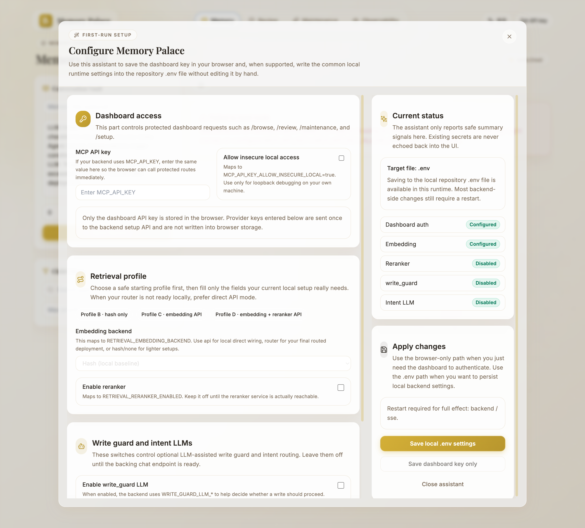

# Memory Palace Dashboard User Guide (English)

> This guide mirrors the **English interface** of the Memory Palace Dashboard.
>
> If your interface is currently in Chinese, click the language toggle in the top-right corner to switch to English. Your preference is saved automatically.

---

## Table of Contents

- [🌐 General Operations](#-general-operations)
- [📂 Memory Page](#-memory-page)
- [📋 Review Page](#-review-page)
- [🔧 Maintenance Page](#-maintenance-page)
- [📊 Observability Page](#-observability-page)
- [❓ FAQ](#-faq)

---

## 🌐 General Operations

### 🧭 Top Navigation Bar

The top of the page has four tabs. Click any tab to switch pages:

| Tab | Page | What It Does |
|-----|------|-------------|
| **Memory** | Memory Page | Browse, create, and edit memories |
| **Review** | Review Page | View change history and decide whether to keep or rollback modifications |
| **Maintenance** | Maintenance Page | Clean up old or unused memories |
| **Observability** | Observability Page | Monitor system health and search performance |

### 🔑 Setting an API Key

In the top-right corner, you may see one of these states:

- **Set API key**: no stored key is configured yet; clicking it now opens the **first-run setup assistant**
- **Update API key / Clear key**: a local key is already stored in the browser
- **Runtime key active**: the page received a runtime-injected key, so manual key entry is usually not needed; the page still keeps a `Setup` entry so you can inspect masked status, move the current key into this browser session, or save it into local `.env`

If neither a runtime key nor a browser-stored key is available yet, and the server-side setup status still does not report Dashboard auth as configured, the first-run setup assistant may open automatically on first load. If you are already on a trusted proxy-held auth path and protected requests work, the page stays on the normal Dashboard flow instead of auto-opening the assistant just because the browser itself does not store the key.

If you close that first-run assistant without saving, the dismissal is only remembered for the current browser session. A fresh browser session can show it again.

When the assistant opens, the Dashboard API key field is focused automatically. Press `Escape` to close the dialog, and use `Tab` / `Shift+Tab` to move around inside it without falling through to the page behind it.

If the Dashboard shell opens but protected data does not load, the usual fix is:

**Set API key** → open the first-run setup assistant → enter the `MCP_API_KEY` value from your `.env` file → choose **Save dashboard key only** or **Save local `.env` settings**.

> If you set `MCP_API_KEY_ALLOW_INSECURE_LOCAL=true` for local development, protected data can load automatically without entering a key, as long as the request is a direct loopback request.

> **Save dashboard key only** stores the Dashboard key in the current browser session (`sessionStorage`) until you clear it manually or that browser session ends. That key now also takes effect immediately for protected Dashboard requests in the current page, even if a runtime-injected key had already been active before you opened the assistant. If `Runtime key active` is showing, opening `Setup` pre-fills the current key, so you can save that same key into the browser session or local `.env` without retyping it from scratch. If you use **Save local `.env` settings** while the Dashboard key field is filled, the assistant now also refreshes the current browser-session key to match. If you clear the Dashboard key field first and then save local `.env` settings, it also clears the old browser key. The first local `.env` save now also requires a non-empty Dashboard key; leaving it blank is rejected by the backend. The assistant's `Profile C/D` presets follow the documented `router + reranker` path, but they are still only suggested starting points, not proof that the setup is already valid. `Profile C` is the local/private router starting point, so its `http://127.0.0.1:8001/v1` base is treated as a real local endpoint, not as a placeholder. `Profile D` keeps the remote template base and still expects you to replace it. Before you save local `.env` settings, the assistant expects the required remote fields to be real values; the documented placeholders that still block save are values such as `https://router.example.com/v1`, `router-embedding-model`, and `router-reranker-model`. On any remote embedding backend (`api` / `router` / `openai`), local `.env` save also requires a real positive-integer embedding dimension, and the assistant no longer guesses one for you. If there is still no Dashboard auth configured and that first local save already includes remote/provider-chain settings, the backend now intentionally collapses it into an auth-bootstrap-only write; save once more after auth is active if you want the remote embedding/reranker/LLM fields to land in `.env`. For provider API bases, enter the service base rather than concrete endpoint suffixes such as `/embeddings`, `/rerank`, or `/chat/completions`; the assistant trims those common suffixes automatically, but malformed or link-local targets are rejected. If your local router is not ready yet, switch the retrieval fields manually to direct `api` / `openai` mode for debugging. If reranker stays enabled on that direct path, you must also fill the direct reranker fields or turn reranker off first.

> If you choose **Save local `.env` settings** and also fill a Dashboard key, remember that the `.env` write and the browser key save are two separate steps. If the browser blocks local storage, the assistant now shows a save failure instead of a false success. In practice that usually means the `.env` change may already be written, but the browser-side auth is still not ready yet.

> Conversely, when both steps succeed, the assistant now keeps the success message and restart reminder visible inside the dialog until you close it yourself, so you can confirm the whole save path finished cleanly before leaving the assistant.

> The `.env` write path is only enabled when the app is running directly against a non-Docker local checkout **and** the current request is a direct loopback request. It only targets project-local `.env*` files. If the page is talking to Docker containers, or you are coming through an authenticated non-loopback path, the assistant can still show the current status but keeps the local `.env` save button disabled on purpose. If the backend is already running with `MCP_API_KEY`, even that loopback write path still expects the same valid key. That is a safety boundary, not a UI failure.

> Opening the assistant just to inspect status is side-effect-free. It does not create the target parent directory before you actually save `.env`.

> If you hit the assistant first and it opens in English, that is still fine on fresh first-run: the assistant has its own language toggle in the upper right corner.

  

### 🌍 Language Toggle

A language toggle button is in the top-right corner. Click it to switch between English and Chinese. Your preference is remembered by the browser.

If the browser already has a stored language choice, the current frontend applies it before the app mounts, so the page title and `document.lang` already match on first paint.

If the setup assistant is already open, it has its own language toggle in the upper right corner. Switching there updates the dialog immediately and keeps what you have already typed.

> If you open the Dashboard in Microsoft Edge, the current frontend automatically switches to a lighter visual mode to reduce local lag. The page layout, buttons, and flows in this guide still apply; the live page may just look a bit flatter than Chrome screenshots.

---

## 📂 Memory Page

> **What is this page for?** Browse and manage all your memory content. You can view existing memories, create new ones, edit content and metadata, or delete memories you no longer need.

### 🗂️ Page Layout

The page is divided into two areas:

- **Left side — Conversation Vault**: Create new memories from dialogue
- **Right side — Current Node Content + Child Memories list**: View and edit existing memories

### 🧭 Breadcrumb Navigation (top of page)

The breadcrumb bar at the top shows your current location, for example: `root > core > agent > preferences`.

- Click any level in the path to jump directly to that node
- **root** is the top-level node — it does not store memory content itself

### ✍️ Left Side: Conversation Vault

This is where you create new memories.

#### 📝 Field Descriptions

| Field | Placeholder Text | Description |
|-------|-----------------|-------------|
| **Memory title** | `Memory title (optional)` | A short name for this memory. Optional but recommended — makes it easier to find later. |
| **Conversation** | Large text area (with grey sample text) | Paste the LLM / Agent dialogue you want to save. **This field is required.** |
| **Priority** | `Priority` | Enter a number. **Smaller numbers mean higher priority**; for example, `0` ranks ahead of `5`. Leave blank for the default value. |
| **Disclosure** | `Disclosure` | A text description controlling when this memory should be surfaced to an Agent. For example: `"Only show when the user explicitly asks"`. Optional — leave blank for no restriction. |

> **What is "Disclosure"?** Think of it as a visibility rule you write in plain language. It tells the system under what conditions this memory should be shown to the AI. For example, if you store a sensitive preference, you might write "only surface when the user asks about preferences." If you're unsure, just leave it blank.

> One practical boundary is worth remembering: the system also validates the final path length. If `parent path + title` is too long, the create request fails before the write starts. The easiest fix is usually to shorten the title or step back to a higher parent and create it there.

#### ✅ Step-by-Step: Creating a Memory

1. Paste your dialogue into the **Conversation** text area
2. (Optional) Fill in **Memory title**, **Priority**, and **Disclosure**
3. Click **Store Memory**
4. The system runs a Write Guard check first — it decides whether the content is worth saving
5. On success, a green notification appears at the bottom: `Memory created: core://xxx`

> **What is the Write Guard?** A safety mechanism that evaluates each write request before it is accepted. From the Dashboard side, the guaranteed visible result is whether the write proceeds or returns `Skipped: write_guard blocked ...`. The more specific backend reason still depends on the server-side decision result.

### 📄 Right Side, Upper: Current Node Content

Displays the full detail of the memory you're currently viewing.

- **Content editor**: Directly edit the memory body text
- **Priority**: Modify the priority number
- **Disclosure**: Modify the disclosure text
- **Save** button: Save your changes
- **Delete Path** button: Remove this memory's access path

> Clicking **Delete Path** brings up a confirmation dialog showing which path will be deleted. The deletion only happens after you confirm.

#### 📌 Gist vs. Original View

Each memory may have a system-generated summary (Gist). Use the **Gist** / **Original** toggle to switch between views:

- **Gist**: A compressed summary auto-generated by the system — useful for quick scanning
- **Original**: The full, unmodified memory content

### 📑 Right Side, Lower: Child Memories

Lists all child memories under the current node as cards.

#### 🔍 Child Filters

A filter toolbar sits above the child list:

| Filter | Placeholder Text | Description |
|--------|-----------------|-------------|
| **Search box** | `Search path / snippet` | Type keywords to quickly filter matching child memories by path and preview snippet |
| **Max priority** | `Max priority (optional)` | Enter a number — only shows memories with priority ≤ this value |

- Each child card shows the current priority, path/title, and snippet or gist preview
- Click any card to navigate into that memory node
- The child list is expanded in frontend batches — click **Load N more** at the bottom to reveal more of the children already loaded for the current node

> If you are editing the current node and then click a breadcrumb or a child card, the page asks whether you want to discard the unsaved edits first.

---

## 📋 Review Page

> **What is this page for?** Every time a memory is created, modified, or deleted, the system takes a "before" snapshot. This page shows you those changes so you can decide: keep the change, or roll it back.
>
> **Scope note**: the Review page only shows snapshot sessions for the **current database target**. If you switch to another local `.env`, another Docker compose project, or another SQLite file, sessions from the old database are intentionally hidden instead of being mixed into the current queue.
>
> **Damaged-session note**: if a snapshot session's metadata is damaged, the backend now first tries to recover it under the original database scope; if that scope cannot be recovered safely, the session stays hidden instead of being auto-deleted by a read-only list load or mixed into the wrong Review queue.

### 🗂️ Page Layout

- **Left side — Review Ledger**: List of sessions and their snapshots
- **Right side — Diff View**: Detailed before/after comparison of a selected snapshot

### 📖 Left Side: Review Ledger

#### 🎯 Target Session

A dropdown at the top labeled **Target Session**. Each batch of AI-driven modifications is grouped into a session.

- If it shows **No active sessions**, there are no pending changes to review
- If you recently switched databases, Docker volumes, or profiles, sessions from the old database are intentionally not shown here
- Select a session to see all modification snapshots under it

#### 📸 Snapshot List

Each snapshot represents a single modification. The card shows:
- **Operation type**: Create / Content / Meta / Delete / Alias
- **Resource path**: The memory path that was modified (e.g., `core://agent/preferences`)

Click a snapshot to load its diff view on the right.

### 🔀 Right Side: Diff View

After selecting a snapshot, this area shows the before/after content comparison:

- **Red / strikethrough text**: Content that was removed
- **Green / highlighted text**: Content that was added
- **Metadata Shifts**: Shows changes to priority, disclosure, or other metadata fields

#### 🎛️ Action Buttons

| Button | Label | What It Does |
|--------|-------|-------------|
| **Integrate** | `Integrate` | Accept this change — clears the snapshot from the review queue |
| **Reject** | `Reject` | Roll back the memory to its state before this change was made |
| **Integrate All** | `Integrate All` | Accept all pending changes in the current session at once |

> **What does "Integrate" mean?** It's essentially "approve." You're confirming that you've reviewed this change and it's fine. The snapshot record is then cleaned up.

> **What happens when I "Reject"?** The memory is restored to its pre-modification state. Deleted content comes back; new content is removed. It's like undoing the change.

> If a newer change lands after you opened this snapshot, the backend may also refuse the rollback at the last moment. In plain language: it now rechecks the current head inside the actual write path, so an older snapshot does not silently overwrite newer content. Metadata-only rollback follows the same fail-closed idea now: if the path disappeared before the actual write, it returns `404`; if the current target or metadata already changed, it returns `409`.

---

## 🔧 Maintenance Page

> **What is this page for?** Helps you clean up "garbage" memories. Over time, some memories become outdated, unreachable (no paths point to them), or decay in vitality. This page finds them and lets you safely delete them.

The subtitle reads: *Manage orphan memories and low-vitality cleanup candidates with human confirmation.*

### 📊 Summary Cards at the Top

| Card | Meaning |
|------|---------|
| **Deprecated** | Number of old versions left behind when memories were updated (like file revision history) |
| **Orphaned** | Number of memories that no path can reach (they exist in the database but have no "entrance") |
| **Low Vitality** | Number of memories whose vitality score has decayed to the point of being deletable |

### 🧹 Upper Section: Orphan Cleanup

> **What is an "orphan memory"?** In Memory Palace, each memory is accessed via a path (e.g., `core://agent/preferences`). If that path is deleted but the memory record still exists in the database, it becomes an "orphan" — it's there but unreachable.

This section lists all orphan memories in two categories:

- **Deprecated Versions**: Old history copies left behind by update operations
- **Orphaned Memories**: Records with zero paths pointing to them

Each card can be expanded to view full content. Diff details only appear when the item is a deprecated version with a `migration_target`. These card headers are keyboard-focusable too, so you can use `Enter` or `Space` to expand them.

#### ✅ Step-by-Step: Cleaning Up Orphans

1. Click **Refresh** to scan for the latest orphan memories
2. Select the memories you want to delete (or use the select-all control in the section header)
3. Click **Delete N orphans**
4. Confirm the deletion in the popup dialog

> ⚠️ Deletion is permanent and cannot be undone. Review each item carefully before confirming.
>
> 💡 If a deprecated item is still the final migration target of older versions, the cleanup dialog will refuse that deletion first. In plain language: start from the older deprecated copies, not the last remaining target.
>
> 💡 Larger batch deletes now fan out a few requests in parallel, but the page still keeps per-item failures and partial-success reporting instead of flattening everything into one pass/fail result.

### 💚 Lower Section: Vitality Cleanup Candidates

> **What is "vitality"?** Every memory has a vitality score representing how "active" it is. Newly created memories start with high vitality. Over time, the score naturally decays. If a memory hasn't been accessed for a long time, its vitality drops very low and the system marks it as a cleanup candidate.

#### 🔍 Filter Fields

| Field | Label | Description |
|-------|-------|-------------|
| **Threshold** | `Threshold` | The vitality score cutoff. The system finds memories with vitality below this number. Lower = stricter filter. |
| **Inactive days** | `Inactive days` | How many days a memory must have been unaccessed to qualify. E.g., `14` means only memories untouched for 14+ days. |
| **Limit** | `Limit` | Maximum number of candidates to display. Range: 1–500. |
| **Domain** | `Domain` | Only show candidates from a specific domain (e.g., `core`, `notes`). Leave blank for all. |
| **Path prefix** | `Path prefix` | Only show candidates whose path starts with this prefix. E.g., `agent/`. |
| **Reviewer** | `Reviewer` | Records who initiated this cleanup review. Optional. The default value is `maintenance_dashboard`. |

#### ✅ Step-by-Step: Vitality Cleanup

1. Fill in filter conditions and click **Apply Filters**
2. Review the candidate list below. Each card shows:
   - `vitality N.NN`: Current vitality score
   - `inactive Nd`: How many days since last access
   - `deletable` or `active paths`: Whether it can be safely deleted
3. Select the memories you want to act on
4. Choose an action:
   - **Prepare Delete (N)**: Mark selected memories for deletion
   - **Prepare Keep (N)**: Mark selected memories to be kept (not deleted)
5. Click **Confirm delete** or **Confirm keep** — the system will ask you to type a confirmation phrase (a safety measure to prevent accidental deletion)
6. Type the exact confirmation phrase to execute the action

> **What does "Run Decay + Refresh" do?** Manually triggers a vitality decay recalculation. The system does this automatically, but click here if you want to see the latest decay results immediately.

> If confirm fails because the phrase was wrong, the key was rejected, or the request just timed out or dropped before the backend used that prepared batch, the prepared review stays on the page so you can fix the problem and retry instead of preparing the whole batch again.

---

## 📊 Observability Page

> **What is this page for?** This is the system's "health report." It shows search engine performance, runtime status, and background job states. **Regular users don't need this page day-to-day** — it's mainly useful for troubleshooting.

The subtitle reads: *Track search latency, degrade reasons, cache hits, and index worker health.*

### 📊 Summary Cards at the Top

| Card | Meaning |
|------|---------|
| **Queries** | Total number of search requests the system has handled |
| **Latency** | Average search response time in milliseconds — lower is better. The small hint below it shows the localized **P95** latency, so you can compare normal latency vs. slow-tail latency at a glance. |
| **Cache Hit Ratio** | Percentage of searches served from cache — higher is better (means repeated queries don't need recalculation) |
| **Index Latency** | Average time for index operations |
| **Cleanup p95** | 95th percentile cleanup time (the "worst-case" speed for cleanup operations) |
| **Cleanup Index Hit** | Hit rate for index lookups during cleanup operations |

### 🎛️ Top Action Buttons

| Button | Label | Description |
|--------|-------|-------------|
| **Refresh** | `Refresh` | Reload all statistics on the page |
| **Rebuild Index** | `Rebuild Index` | Submit a full index rebuild job request. Use when search quality has noticeably degraded. |
| **Sleep Consolidation** | `Sleep Consolidation` | Submit a memory consolidation job request. |

> **What is "Rebuild Index"?** It submits a rebuild request to the backend. Use it when the index may be out of date or search quality looks wrong. Think of it as asking the backend to rebuild the table of contents.

> **What is "Sleep Consolidation"?** It submits a consolidation job request to the backend. Its goal is to help the system reorganize fragmented memory records, but the exact effect still depends on backend policy and current runtime state.

### 🔎 Search Console

A diagnostic tool that lets you run a test search to evaluate retrieval quality.

#### 📝 Field Descriptions

| Field | Label | Description |
|-------|-------|-------------|
| **Query** | `Query` | The keywords or question you want to search for |
| **Mode** | `Mode` | Search mode. Options: hybrid (recommended — combines keyword + semantic), semantic (meaning-based), keyword (exact match) |
| **Session Id** | `Session Id` | (Optional) If filled, results from this session are prioritized |
| **Max Results** | `Max Results` | Maximum number of results to return |
| **Candidate x** | `Candidate x` | Internal candidate multiplier. Higher = broader search but slower. Default is usually fine. |
| **session-first** | `session-first` | Check this to prioritize memories from the current session in results |
| **Domain filter** | `Domain filter` | (Optional) Restrict search to a specific domain, e.g., `core` |
| **Path prefix filter** | `Path prefix filter` | (Optional) Only search under a path prefix |
| **Scope hint** | `Scope hint` | (Optional) A hint to guide the search engine's scope. E.g., `core://agent` |
| **Max priority filter** | `Max priority filter` | (Optional) Only return memories with priority ≤ this value |

Click **Run Diagnostic Search** to execute. Results and diagnostics appear below.

### 🩺 Search Diagnostics

After running a search, this section shows:

- **latency**: How many milliseconds the search took
- **mode**: The actual retrieval mode used
- **interaction tier**: Whether this search stayed on the fast path or escalated to the deep path
- **intent**: The query intent or applied intent label returned by the backend
- **intent LLM attempted**: Whether the backend actually tried the LLM-based intent classifier during this diagnostic run
- **strategy**: Which search strategy was selected
- **degraded**: Whether the backend marked this search as degraded; if so, the specific reasons are shown here
- **Result list**: Each result shows its match score, content snippet, source path, and update metadata

If a final path revalidation lookup fails, the stale result is dropped instead of being shown anyway, and the diagnostics surface the degradation reason so you can tell the difference between "nothing matched" and "the last safety check failed."

### ⚙️ Runtime Snapshot

Displays the system's current operational status:
- Whether the index is healthy or degraded
- Queue depth (how many tasks are waiting)
- Last worker error message
- Sleep consolidation status
- Reflection workflow counters (prepared / executed / rolled back), so you can see whether review-driven reflection actions are only queued, actually executed, or already rolled back

### 📋 Index Task Queue

Lists running or recently completed index tasks. Each task can be:
- **Inspect**: View task details
- **Cancel**: Stop a running task
- **Retry**: Re-execute a failed task

---

## ❓ FAQ

### Q: The page loads but shows no data?

This usually means **the API key hasn't been configured**. Click **Set API key** in the top-right corner to open the setup assistant, enter the `MCP_API_KEY` value from your `.env` file, and first use the browser-only save path so the Dashboard can authenticate. Only use the `.env` write path when you are on a non-Docker local checkout. That local write path only targets project-local `.env*` files, and if the backend is already running with `MCP_API_KEY`, the same valid key is also required for the loopback write. If **Save local `.env` settings** reports a failure, a common case is that the backend-side `.env` write already succeeded but the browser still could not save the Dashboard key locally.

If you are using **Save local `.env` settings**, remember three current boundaries: the first local save requires a non-empty Dashboard key; if there is still no Dashboard auth and that same first save already includes remote/provider-chain settings, the backend performs only the auth bootstrap and expects a later save for the remote fields; and provider API base fields should point at the service base, not concrete suffixes such as `/embeddings`, `/rerank`, or `/chat/completions`. Those common suffixes are normalized automatically, but malformed or link-local targets are rejected.

### Q: I clicked "Store Memory" and it says "Skipped"?

The Write Guard blocked this write request. From the Dashboard side, the exact backend reason is not always visible; modify the content and try again, or inspect the backend response if you need the detailed cause.

### Q: What number should I use for Priority?

There's no fixed range. A simple rule of thumb: use `0` for critical core memories, `5` for normal ones, and larger numbers for weaker hints that can rank later. Remember: **smaller number = higher priority**.

### Q: Can I undo "Integrate" or "Reject"?

- **Integrate** clears the snapshot record, but the memory content itself is unchanged
- **Reject** rolls back the memory to its pre-change state; if you later decide the change was needed, you'll need to re-create it

### Q: Why did rollback return `409` or `404`?

That usually means the current path state changed after you opened the snapshot. A common `409` case is that the same URI already has a newer content snapshot in another Review session, or the current metadata changed again before the actual rollback write. A common `404` case is that the path disappeared before rollback actually wrote. In practice: check the newer change or the current path first, then decide whether the older rollback is still what you want.

### Q: Why did I suddenly see the fallback error page?

That is the dashboard's root fallback shell. It means the frontend hit an unexpected render-phase error and stopped the page from continuing in a broken state. The copy on that page now follows the current locale instead of always showing the English string `Something went wrong.`. First try a normal refresh. If the same screen comes back, keep the browser console and backend logs from that moment for debugging.

### Q: Does vitality automatically recover?

No. Vitality only decays over time. However, each time a memory is accessed (through reads or search hits), the vitality receives a "refresh" that slows the decay rate.

### Q: When do I need to manually "Rebuild Index"?

When you notice that memories you know exist aren't showing up in search results. Under normal use, the index is maintained automatically.
